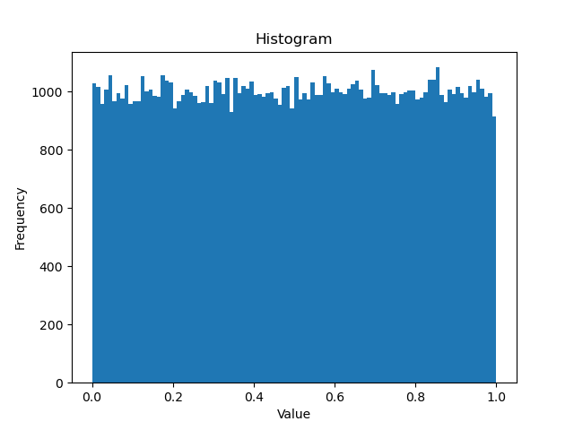

# GPU-Philox
cuda philox PRNG impl in a single function (verfied against python numpy)

## Background
Philox is a pseudo-random number generator that is commonly used to generate random numbers in deep learning. In the process of generating random numbers, Philox uses counters to engage in basic mathematical operations such as addition, multiplication and xor. These operations transform the counter value to produce a new pseudo-random number.

Specifically, in Philox, the value of the counter is used to generate a random sequence of numbers. Each time a random number is generated, the counter's value is updated and is involved in basic operations such as addition, multiplication and xOR. These operations transform the counter value to produce a new pseudo-random number. By constantly updating the counter and performing basic calculations, Philox generates a series of seemingly random values. These random numbers can be used in a variety of application scenarios in deep learning, such as data enhancement, model initialization, Dropout, etc.
 
Philox's counter can be 32-bit, 64-bit, or 128-bit, depending on how large a random number the generator needs to generate. The reason for this is to balance performance and randomness. If the number of counter bits is larger, it will take longer to generate the random number, but the random number generated will be more random. Specifically, while it is possible to extend the arguments of the Philox function from 64 to 128 bits to enable it to handle larger counters, using larger counters increases the computational cost of the Philox function. Therefore, the appropriate counter size needs to be selected according to the requirements of the specific application.

This is because the Philox algorithm requires a 128-bit input to be seeded, and its output should also be 128-bit. This design can ensure that the generated random number sequence has good randomness and distribution. In addition, 128 bits is also the native bit width of most current computer hardware, so Philox's output can also interact more efficiently with computer hardware. 32-bit Philox is feasible, but it generates random number sequences in a short period and can be repetitive. If higher quality random number sequences are needed, consider using 64-bit Philox or another stronger pseudo-random number generator.

The subsequence parameter in the Philox PRNG is used to generate different subsequences of pseudorandom number sequences. By running PRNG on different subsequence values, different sequences of random numbers can be generated to avoid repeating random numbers in multiple parallel computations.

## Algorithm
Philox is a pseudo-random number generator that uses an algorithm based on integer addition, rotation, and xor operations. The basic idea of Philox algorithm is to convert a 64-bit input (i.e. seed) through a series of algorithms into a sequence of pseudorandom numbers, where each pseudorandom number is 32 bits. At the heart of Philox's algorithm is a loop function that takes input seeds and a counter as input, then generates a 32-bit pseudo-random number and incrementing the counter by one. The output of the loop function becomes the next input seed, and then the loop function is called again to generate the next pseudo-random number. By repeatedly calling the loop function, Philox algorithm can generate a pseudo-random number sequence of arbitrary length.

The key of this algorithm is that it has two registers: the seed register and the state register. If either of these two is different, a different sequence of random numbers will be generated. stateless means that every run generates the same sequence of random numbers, as long as the seed is determined.

Philox is a pseudo-random number generator whose input parameters are a 128-bit seed value and a 64-bit counter value. The generator uses these parameters to produce a sequence of pseudorandom numbers.

To produce a random output between 0 and 1, use the random number generated by Philox as an integer, then divide it by the range of the generator (that is, 2 to the power of the generator bits) to get a random output between 0 and 1. For example, if the random number generated by Philox is a 32-bit integer, then dividing by 2 to the power of 32 gives random output between 0 and 1.

## Benifits
Philox algorithm has high performance and is suitable for applications requiring high-quality pseudorandom numbers, such as cryptography and simulation. Benefits of using philox: 
* Counter-based, easy to parallelize
* Crush-resistant, reducing the risk of statistical failures

## Result
The following figure shows the histogram of the generated random data.

## References
[1] Salmon, John K., et al. "Parallel random numbers: as easy as 1, 2, 3." Proceedings of 2011 international conference for high performance computing, networking, storage and analysis. 2011.

[2] https://numpy.org/doc/stable/reference/random/bit_generators/philox.html